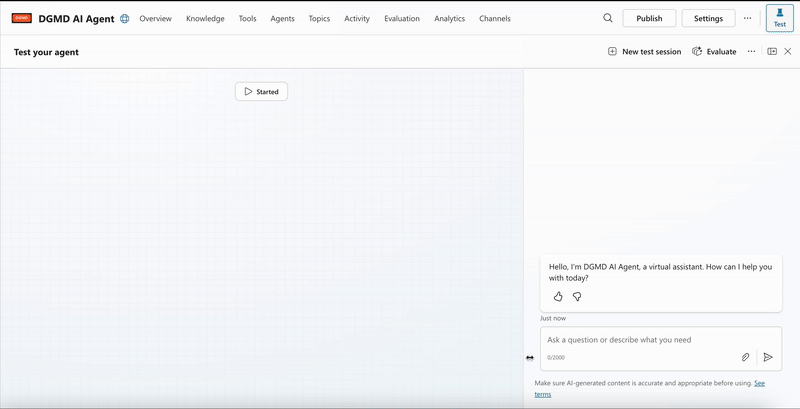
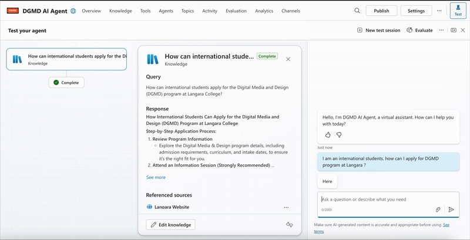
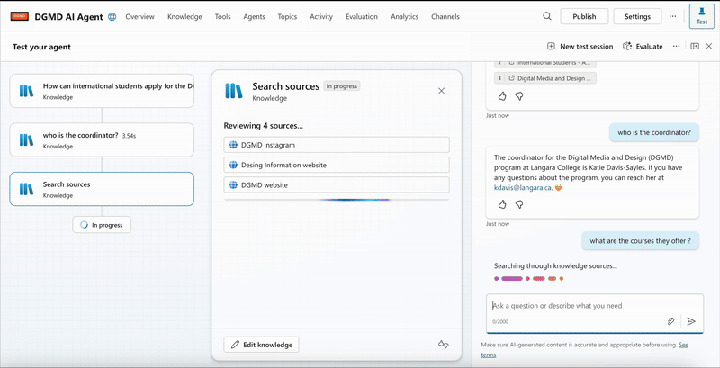

# DGMD AI Agent (Copilot Studio)

An internal Copilot agent designed to help prospective and current students find **accurate, up-to-date information** about Langara College’s **Digital Media & Design (DGMD)** program.  

This assistant does **not** invent answers. It only responds based on approved DGMD sources so students always receive reliable information.

---

## 📸 Demo

### 1. Starting the DGMD AI Agent

### 2. Answering “How can international students apply?”

### 3. Searching across DGMD knowledge sources

---

---

## 🎯 Goal

- Answer common questions about the DGMD program in **one place**  
- Reduce repetitive email questions for staff  
- Help students quickly find **correct links, steps, and contacts**  
- Respect the college requirement: **no free-form AI hallucinations**, only trusted content

---

## 🚀 Key Features

- **Focused on DGMD only**  
  - Admissions & application steps  
  - Program overview and outcomes  
  - Course offerings and structure  
  - Important dates & info sessions  
  - Coordinator and department contact info  

- **Knowledge-only answering**
  - Agent is configured to answer **only** from the provided knowledge sources  
  - If information is not found, it tells the user and directs them to official pages  
  - No creative or speculative AI answers

- **Short, student-friendly responses**
  - Clear steps and bullet points  
  - Direct links to the correct page (application, courses, contact, etc.)

---

## 🧠 Knowledge Sources

The agent searches across curated DGMD resources, for example:

- DGMD / Digital Media and Design program website  
- Design Formation / DGMD information pages  
- DGMD / Design Formation Instagram (for event + info-session details)  
- Other approved Langara pages related to DGMD

These sources are maintained by the department, so answers stay aligned with official information.

---

## 🔍 How It Works

1. **User asks a question**  
   > “How can international students apply for the DGMD program?”  
   > “Who is the coordinator?”  
   > “What courses do they offer?”

2. **Copilot searches knowledge sources**  
   - Uses Copilot Studio “Knowledge” to index the DGMD websites  
   - Retrieves the most relevant passages

3. **Agent returns a controlled answer**  
   - Summarizes the steps in simple language  
   - Provides the **exact link** to the official page  
   - If the answer is not in the knowledge base, it responds with a safe fallback and suggests where to look next

4. **No knowledge = no answer**  
   - By design, the agent will not guess or invent program details

## 🧩 Tech Stack

- **Microsoft Copilot Studio**
  - Agent orchestration and test canvas
  - Knowledge sources connected to DGMD / Langara websites

- **Microsoft 365 / Entra ID**
  - Runs inside the organization’s tenant
  - Access restricted to approved users (staff, internal testing, etc.)

---

## ✅ Usage Ideas

- Embed into **Langara Teams environment** for staff and student support  
- Add as a **link or widget** from DGMD website for quick FAQ help  
- Use during **info sessions** so presenters can show real-time answers

---

## 🔒 Limitations & Guardrails

- Answers are only as complete as the **knowledge sources**  
- The agent:
  - Does **not** handle personal student data  
  - Does **not** replace academic advising  
  - Does **not** generate creative or unofficial advice about the program

If a question is outside the DGMD scope, the agent will point the user to the correct website or contact instead of guessing.

---

## 📌 Future Improvements

- Add topic-specific prompts (e.g., “Portfolio Requirements”, “Tuition & Fees”, “Career Outcomes”)  
- Integrate with a feedback form so staff can see which questions students ask the most  
- Localize responses for international students (plain English / other languages)

---

